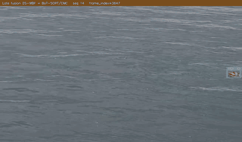
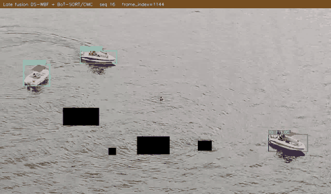
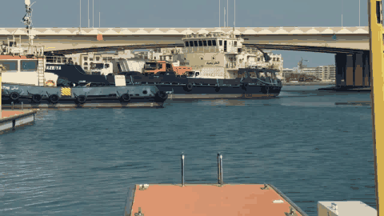
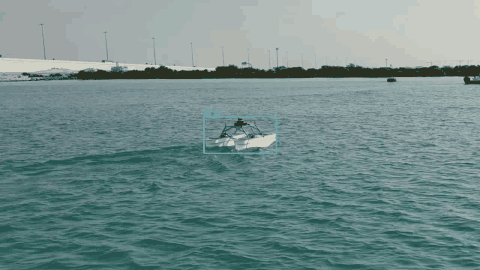
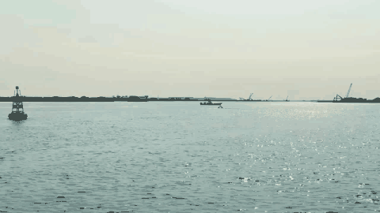
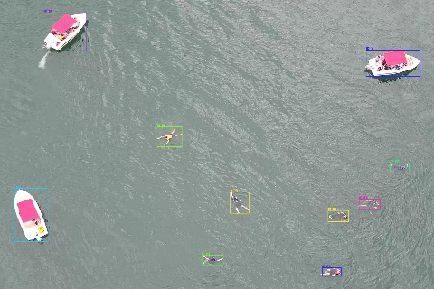
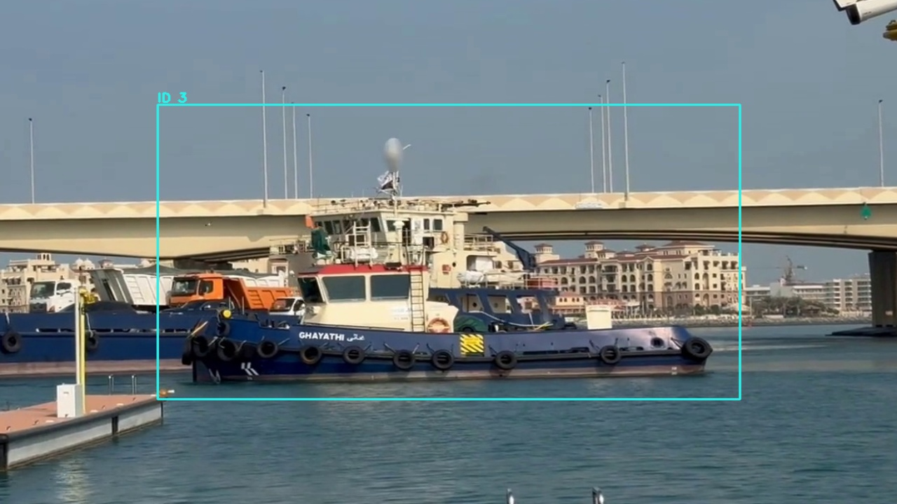
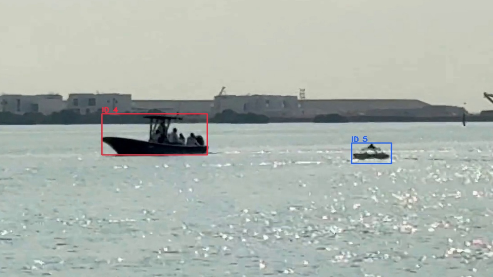
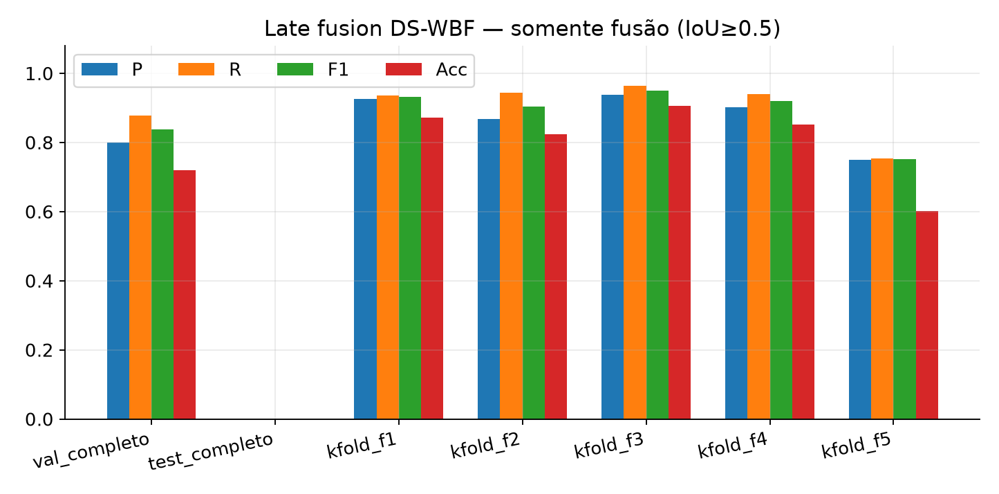
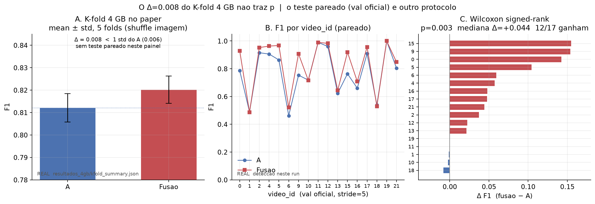

# Late fusion DS-WBF (maritime UAV)

Anonymous code release. **A** = YOLOv8s-Sea + Soft-NMS. **B** = YoloOW. **Fusion** = spatial match → Dempster-Shafer-*inspired* conflict gate → WBF. The tracker sees fusion boxes only.

Weights (`.pt`) and datasets are **not** in this repository. Paths are environment variables only (`env.example`). There are no machine-specific home directories in the source.

## Tracking (short GIFs)

SeaDronesSee, fused boxes + ID, no motion trails:

| seq 14 | seq 16 |
|--------|--------|
|  |  |

MVTD:

| 1-Ship | 16-USV | 127-Boat |
|--------|--------|----------|
|  |  |  |

Stills (same crop window, fusion):

<p>



</p>

## Metrics

Protocol on every row: **local IoU ≥ 0.5, same class**. Not Ultralytics `val` mAP. Not YoloOW `train.py` `Labels=0`. Do not average rows.

### SeaDronesSee official val (n = 8584, no stride)

Active classes `{swimmer, boat, life_saving_appliances}`. Soft-NMS on A. Public test has empty box GT: **no test F1**.

| method | P | R | F1 | TP | FP | FN |
|--------|------|------|------|------|------|------|
| A | 0.719 | 0.863 | 0.784 | 41126 | 16105 | 6552 |
| B | 0.889 | 0.560 | 0.687 | 26714 | 3337 | 20964 |
| Fusion | 0.826 | 0.870 | **0.847** | 41463 | 8753 | 6215 |

Partial summation: fusion cuts A's FP roughly in half and slightly raises recall.



### SeaDronesSee 4 GB K-fold eval-only (frozen weights)

Image shuffle, seed 20. Mean ± std over 5 folds. **Not** a paired test across `video_id`.

| method | P | R | F1 | Acc |
|--------|------|------|------|------|
| A | 0.820±0.008 | 0.805±0.005 | 0.812±0.006 | 0.684±0.009 |
| B | 0.936±0.002 | 0.607±0.005 | 0.736±0.004 | 0.582±0.006 |
| Fusion | 0.830±0.007 | 0.811±0.005 | **0.820±0.006** | 0.695±0.009 |

Δ F1 vs A = **0.008**, smaller than one fold std. This table does **not** support a claim of statistical superiority.

### Paired Wilcoxon by `video_id` (official val, stride 5)

Frozen paper weights and fusion thresholds. n = 17 videos. α = 0.05 declared in advance. Shapiro p = 0.013 (normality rejected; Wilcoxon is the primary test).

| mediana Δ (F − A) | fusion wins / loses / ties | Wilcoxon p (two-sided) |
|-------------------|----------------------------|-------------------------|
| +0.044 | 12 / 3 / 2 | 0.003 |

This is **another protocol** than the 4 GB K-fold. It does not rewrite Δ = 0.008.



### MVTD val / test (stride 5, B = Sea leftover)

4 classes. Fusion F1 can fall **below** A because KEEP_BOTH leftovers add FP. Deployed MVTD system stays A-only until B stops flooding.

| split | method | P | R | F1 | n |
|-------|--------|------|------|------|------|
| val | A | 0.549 | 0.861 | **0.670** | 5209 |
| val | B | 0.251 | 0.151 | 0.189 | 5209 |
| val | Fusion | 0.444 | 0.878 | 0.590 | 5209 |
| test | A | 0.391 | 0.589 | **0.470** | 4080 |
| test | B | 0.024 | 0.009 | 0.013 | 4080 |
| test | Fusion | 0.333 | 0.591 | 0.426 | 4080 |

## Layout

```
├── paths.py                 # env-only (FUSAO_ROOT, MVTD_ROOT, …)
├── env.sh / env.example
├── smoke_infer.py
├── latefusion/              # DS-WBF + Soft-NMS + SDS/MVTD runners
├── finetune_yolosea/        # YOLOv8s, init COCO
├── finetune_yoloow/         # configs + scripts; clone Xjh-UCAS/YoloOW here
├── data_prep/
└── pesos/                   # README only; put .pt here or in $WEIGHTS_DIR
```

## Install

```bash
git clone <repository-url>
cd dswbf-latefusion
python -m venv .venv && source .venv/bin/activate
pip install -r requirements.txt

git clone https://github.com/Xjh-UCAS/YoloOW.git finetune_yoloow/YoloOW
pip install -r finetune_yoloow/YoloOW/requirements.txt

cp env.example .env   # set FUSAO_ROOT, WEIGHTS_DIR, MVTD_ROOT
source env.sh
python smoke_infer.py
```

`paths.py` never hardcodes a user home. Discovery: `$FUSAO_ROOT`, else a parent that already contains `datasets/` or `weights/`.

YoloOW source is **not** vendored (`.gitignore`). Weights are **not** committed. CI `.github/workflows/no-weights.yml` fails if a `.pt` or video sneaks in.

## Docs

| file | content |
|------|---------|
| [docs/SETUP.md](docs/SETUP.md) | venv, env, YoloOW clone |
| [docs/WEIGHTS.md](docs/WEIGHTS.md) | which checkpoints, where |
| [docs/DATASETS.md](docs/DATASETS.md) | SeaDronesSee, MVTD |
| [docs/INFERENCE.md](docs/INFERENCE.md) | smoke + eval |
| [docs/LATEFUSION.md](docs/LATEFUSION.md) | DST-inspired formulae |
| [THIRD_PARTY.md](THIRD_PARTY.md) | YoloOW, Ultralytics, Soft-NMS, WBF |

## License

Original code: [MIT](LICENSE) (Anonymous Authors). Third parties: [THIRD_PARTY.md](THIRD_PARTY.md).
